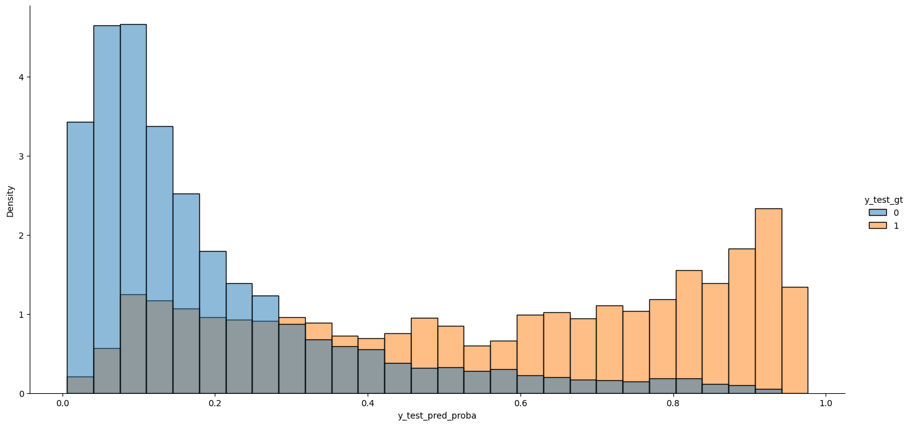
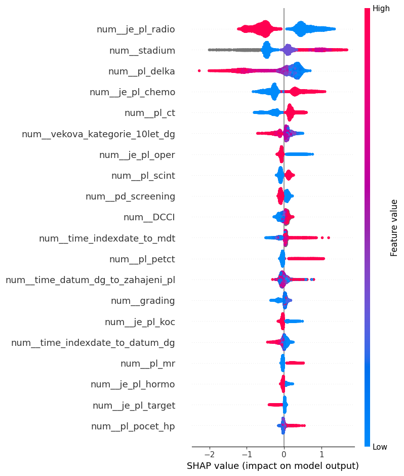
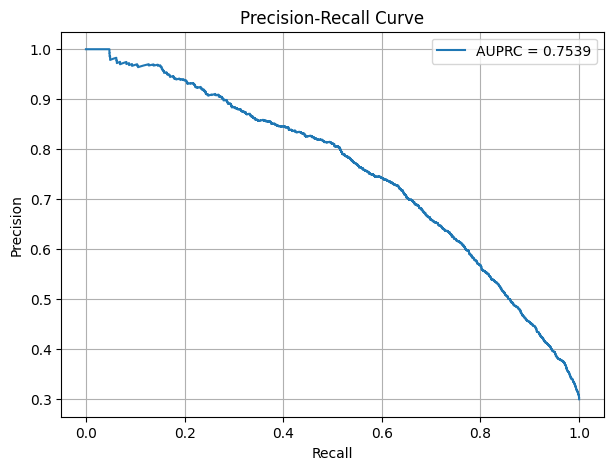
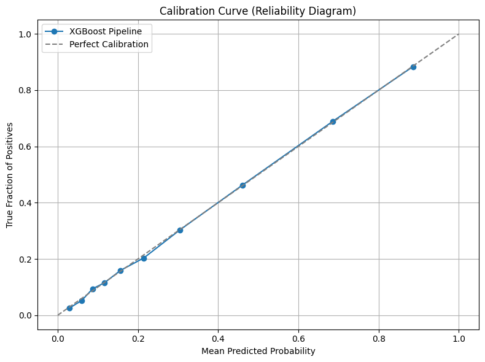
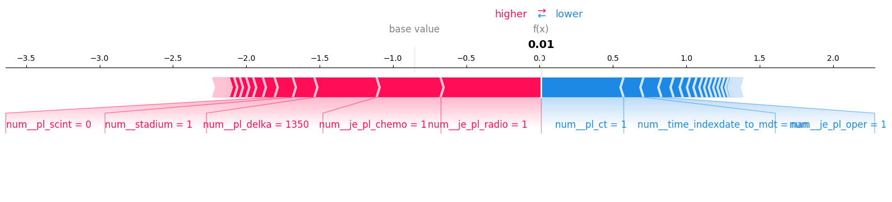
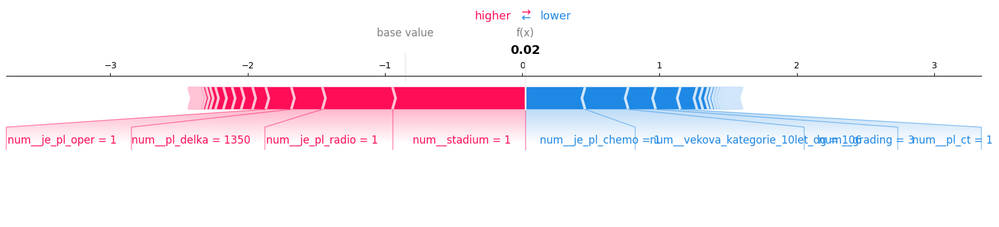

# DataTherapy
This project was developed as part of Rakathon 2025, a healthcare data science hackathon, with the goal of leveraging machine learning to support early detection of critical outcomes in breast cancer patients.

We used real-world clinical data from ÚZIS (Institute of Health Information and Statistics of the Czech Republic) to predict patient-level risk of relapse within 5 years of primary diagnosis. However, we extended the scope to also include 5-year mortality, after discovering that focusing on relapse alone often underestimated risk in severely ill patients.

By incorporating death as an additional endpoint, we were able to better reflect true patient trajectories — particularly in cases where relapse was not recorded due to early mortality. This dual-target approach improved our model's sensitivity to critical conditions and enhanced its practical clinical value.

To make the solution more robust and production-ready, we also trained a dedicated model for predicting 5-year mortality after primary treatment. This model can be used in conjunction with the relapse predictor — allowing clinicians to assess both relapse risk and overall survival probability. Used together, they provide a more holistic view of patient prognosis, supporting smarter treatment planning and prioritization.

## Model evaluations
* Models ability to separate between classes

  

* Most important features decided by the model

  

* Precision - recall curve

  

AUPRC of ~0.75 indicates the model can effectively separate high-risk from low-risk patients.
The curve starts near (0,1), which means the model can achieve very high precision at low recall — it's confident about a small subset of risky patients.
Precision drops as recall increases, which is expected — the model must cast a wider net, which includes more false positives.

* Calibration curve

  

## Example on a single patient
Usage example can be a patient, between 60-69 years of age, with stadium 1 and grading 3 among many other specifics. The probability of relapse or death within next 5 years was **36.6%**. We wanted to test how the situation would change if we would use hormonotherapy as part of primary treatments.

  

After applying hormonotherapy as part of primary treatments, the model predicts probability of **25.4%**.

  

## Example usage:
`import os
import requests
import numpy as np
import pandas as pd
import json

def create_tf_serving_json(data):
    return {'inputs': {name: data[name].tolist() for name in data.keys()} if isinstance(data, dict) else data.tolist()}

def score_model(dataset):
    url = 'https://adb-6675301098417980.0.azuredatabricks.net/serving-endpoints/5y_cancer_mortality_at_diagnosis/invocations'
    headers = {'Authorization': f'Bearer {os.environ.get("DATABRICKS_TOKEN")}', 'Content-Type': 'application/json'}
    ds_dict = {'dataframe_split': dataset.to_dict(orient='split')} if isinstance(dataset, pd.DataFrame) else create_tf_serving_json(dataset)
    data_json = json.dumps(ds_dict, allow_nan=True)
    response = requests.request(method='POST', headers=headers, url=url, data=data_json)
    if response.status_code != 200:
        raise Exception(f'Request failed with status {response.status_code}, {response.text}')
    return response.json()`